# Windows DualSense & DualShock 4 for Unreal Engine version 5.2 ~ 5.6


### **Plugin with full support for DualSense (PS5) and DualShock 4 (PS4) controllers in Unreal Engine versions 5.2 ~ 5.6, for Windows platforms. No configuration needed.**

### All controller customization features—such as vibration, haptic feedback, and LEDs—can be implemented directly in C++ or Blueprints. Below, we provide examples of both implementations.

### Supports advanced settings for triggers, haptic feedback, native Unreal force feedback Blueprint integration, vibrations, LEDs, battery level, gyroscope, accelerometer, and more.

### [Links for installation](#Install-on-FAB-official-page-plugin-)

# Usage via Blueprints
### [See the example video](https://www.youtube.com/watch?v=GrCa5s6acmo)

### Controller Vibration, Audio, and Motor Force Reduction Settings

### Vibration Modes
You can easily customize the vibration mode of the DualSense controller to suit your gameplay needs. This includes switching between different rumble patterns and intensities or applying advanced trigger haptics for more immersive feedback. Both C++ and Blueprint interfaces are available for fine-grained control.

### Audio Configuration
The plugin supports audio-based vibration, allowing controller rumble to be driven by real-time audio signals from the game. This feature creates a more dynamic and immersive haptic experience, as the controller responds to in-game audio effects.

Use vibration mode `EDualSenseDeviceFeatureReport::HapticSoftRumble` when connected via USB for vibration and automatic synchronization of rumble with in-game audio, with no additional setup required.

If you are using Bluetooth, use `EDualSenseDeviceFeatureReport::DefaultRumble`. In this case, you will need to configure audio-based vibration manually as shown in the [Audio-Based Vibration Support](#audio-based-vibration-support) section.

Only Usb Conneciton
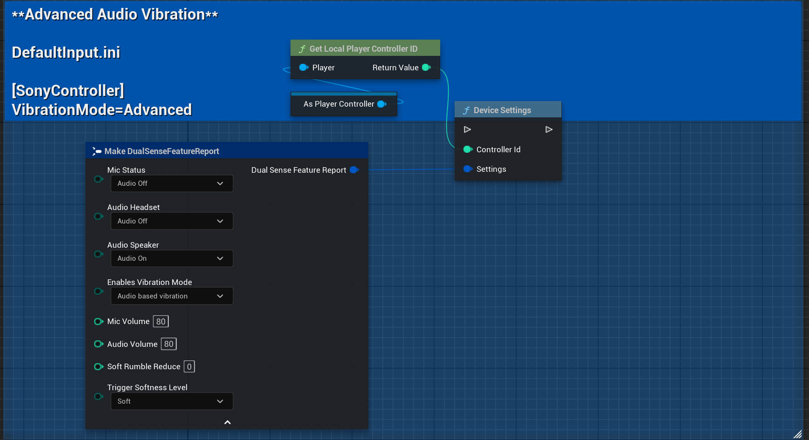

### Soft Rumble (Motor Force Reduction)
To provide a softer, less intense vibration, you can reduce the force of the vibration motors. This setting is useful for creating subtle feedback or making long play sessions more comfortable.

**Example settings in Blueprints:**
Open the settings menu in your Blueprint graph to adjust vibration mode, toggle audio-based rumble, and configure the Soft Rumble Reduce option, as shown in the image below:


### Basic example to check connection or reconnect

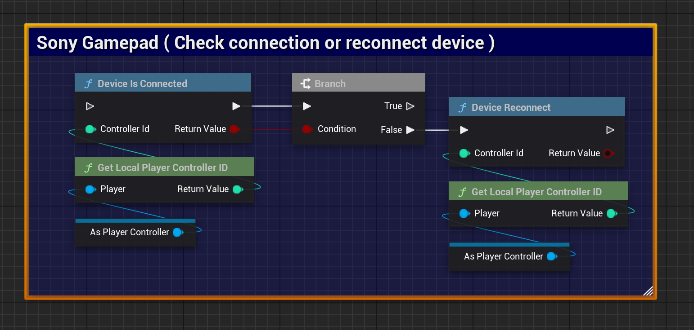

### Disconnect device

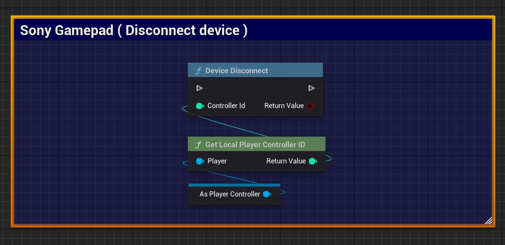

### Gamepad status

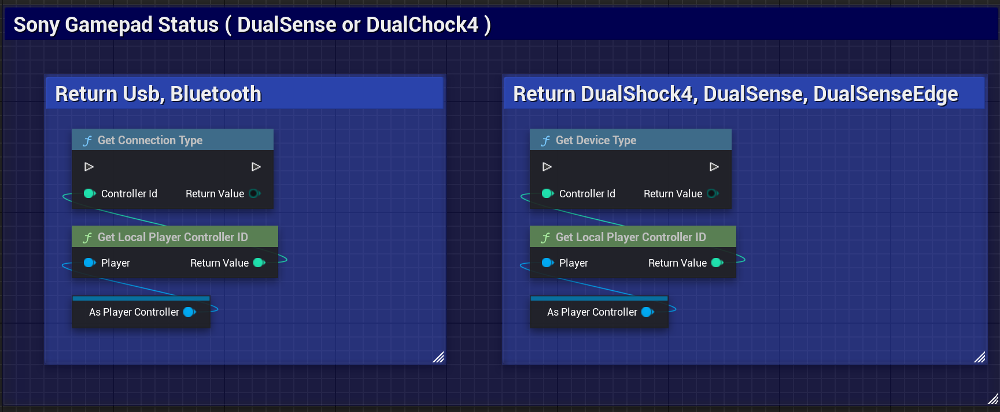

### Basic example apply Lightbar

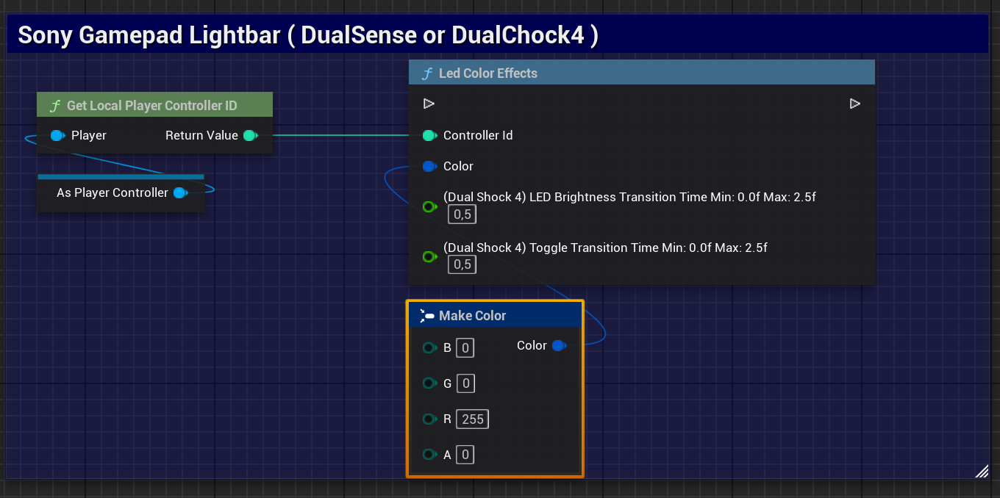

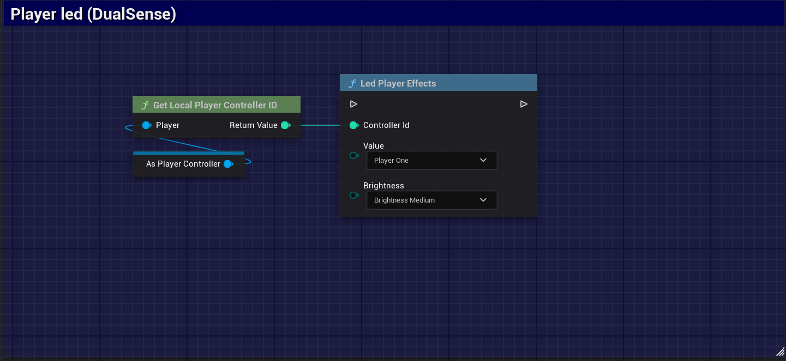

### Vibration force feedback

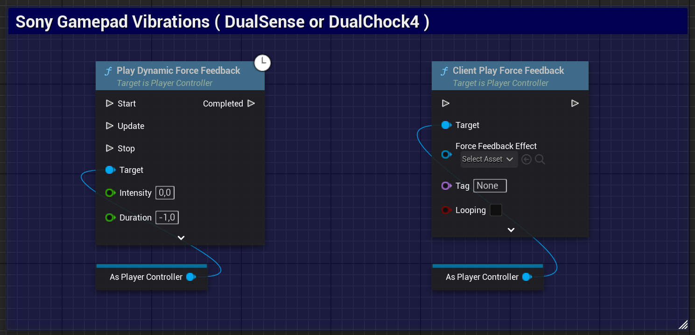

### Trigger effects - DualSense 

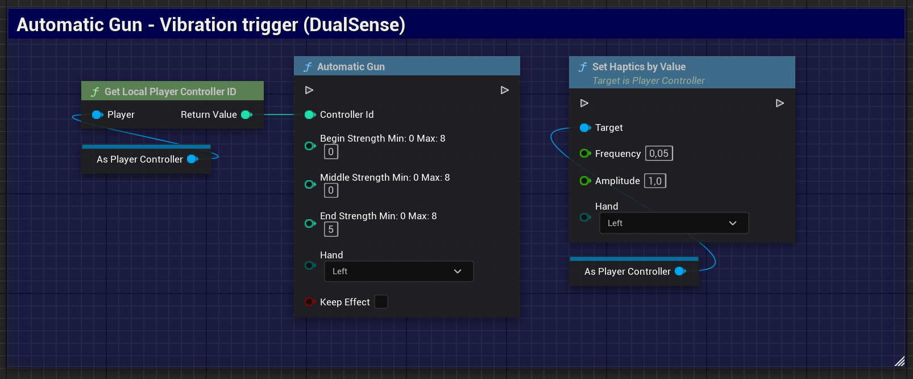

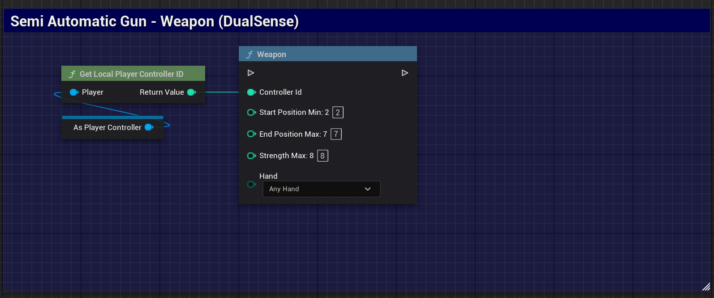

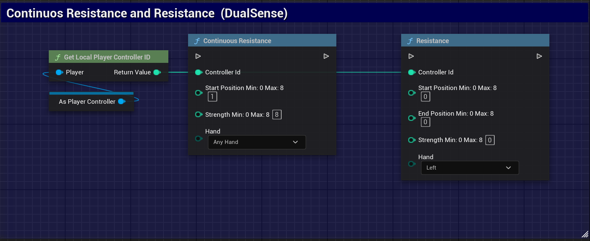

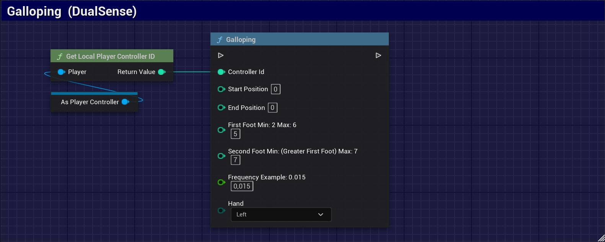

### Audio-Based Vibration Support
The plugin now features audio-based vibration support, enabling controller vibrations to react dynamically to in-game audio signals. This provides a more immersive and responsive user experience.


## Multiple players with multiple controllers

### In your GameMode, add the players.


### After that, connect the players to the controllers.


# Example using C++

>NOTE: Support for **DualShock 4** controllers is still under development.  
Some features may be incomplete or unavailable in the current version.

### USonyGamepadProxy (DualSense) and (DualShock 4)
```
	USonyGamepadProxy::DeviceIsConnected(int32 ControllerId);
	USonyGamepadProxy::DeviceReconnect(int32 ControllerId);
	USonyGamepadProxy::DeviceDisconnect(int32 ControllerId);
	USonyGamepadProxy::LevelBatteryDevice(int32 ControllerId);
	USonyGamepadProxy::LedColorEffects(int32 ControllerId, FColor Color);
	USonyGamepadProxy::LedPlayerEffects(int32 ControllerId, ELedPlayerEnum Value, ELedBrightnessEnum Brightness);
	USonyGamepadProxy::LedMicEffects(int32 ControllerId, ELedMicEnum Value);
	
	PlayDynamicForceFeedback(0.5f, 3.f, true, true, true, true);
```

### UDualSenseProxy Trigger effects
```
	UDualSenseProxy::AutomaticGun(0, 0, 0, 8, EControllerHand::Left, true);
	UDualSenseProxy::Weapon(0, 0, 0, 8, EControllerHand::AnyHand);
	UDualSenseProxy::Galloping(0, 2, 5, 2, 5, 0.005, EControllerHand::Left);
	UDualSenseProxy::Resistance(0, 1, 8, 8, EControllerHand::Right);
```
### UDualSenseProxy Example reset effects
```
	UDualSenseProxy::StopAllTriggersEffects(0);
	UDualSenseProxy::StopTriggerEffect(0, EControllerHand::Left);
	UDualSenseProxy::StopTriggerEffect(0, EControllerHand::Right);
	UDualSenseProxy::StopTriggerEffect(0, EControllerHand::AnyHand);
```


# Install on FAB official page plugin 

To install this plugin directly via FAB (Official Source), follow the steps below:

1. **Access the plugin's official page on FAB**  
   Go to the official plugin page [by clicking here](https://www.fab.com/listings/e77a8f1d-8bbe-4673-a5ae-7f222c8c0960).

3. **Install the Plugin**
   - On the plugin page, click the **Install** or **Add to Project** button (depending on the FAB interface).
   - Choose your Unreal Engine project where the plugin will be used, or simply download it for manual setup.

4. **Configure in Unreal Engine**
   - Open your project in Unreal Engine.
   - Go to the **Plugins** tab under `Edit > Plugins`.
   - Search for `Windows DualSense Plugin` in the list and enable it if necessary.
   - Restart the project to apply the changes.

---
## 📍 Roadmap

To follow ongoing development and planned features for DualShock and DualSense support, please check our project roadmap:

[🔗 View the Roadmap on GitHub Projects](https://github.com/users/rafaelvaloto/projects/2)

---

## Contributions
Thanks to,

[DualSense on Windows API](https://github.com/Ohjurot/DualSense-Windows) library, which facilitated the development of this plugin.

[Nielk1 on GIST](https://gist.github.com/Nielk1/6d54cc2c00d2201ccb8c2720ad7538db) code, which facilitated the development of this plugin.

[DualSenseAPI](https://github.com/BadMagic100/DualSenseAPI/tree/master) library, which facilitated the development of this plugin.

[flok pydualsense](https://github.com/flok/pydualsense) library, which facilitated the development of this plugin.