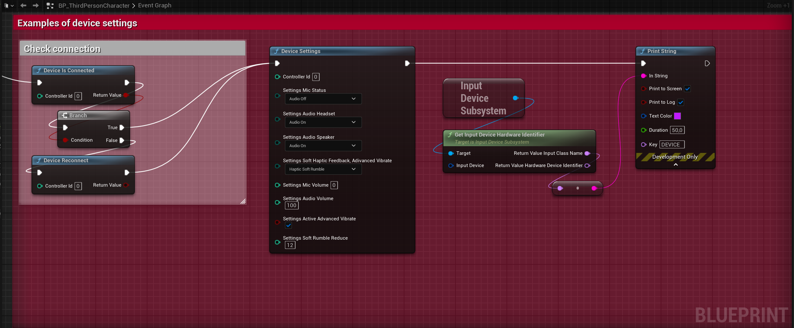
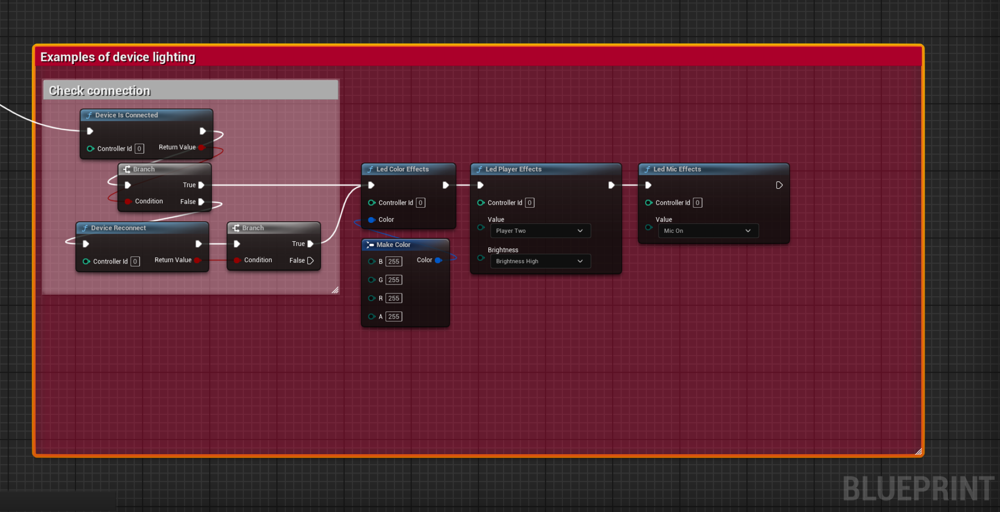
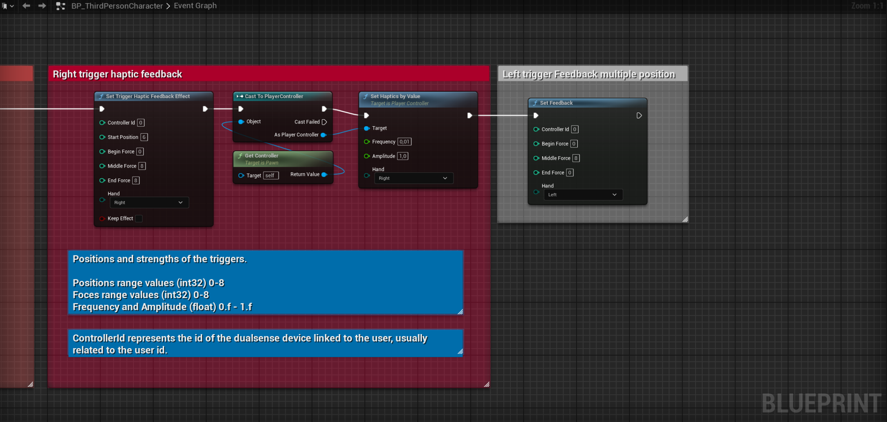
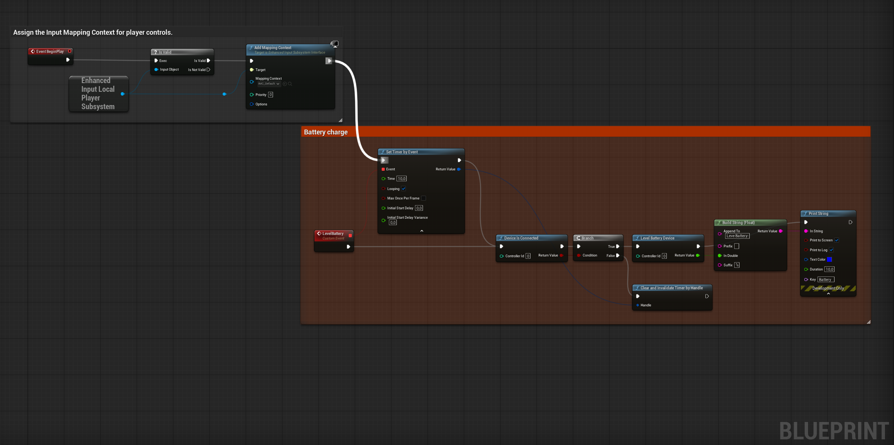
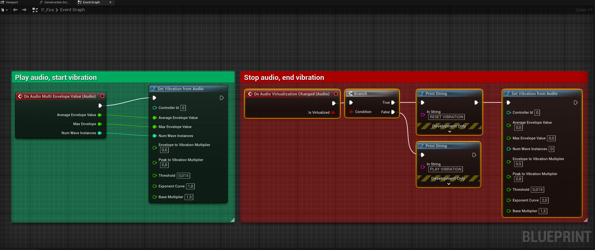
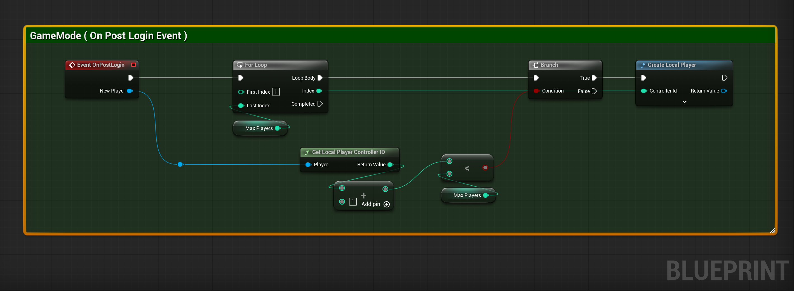
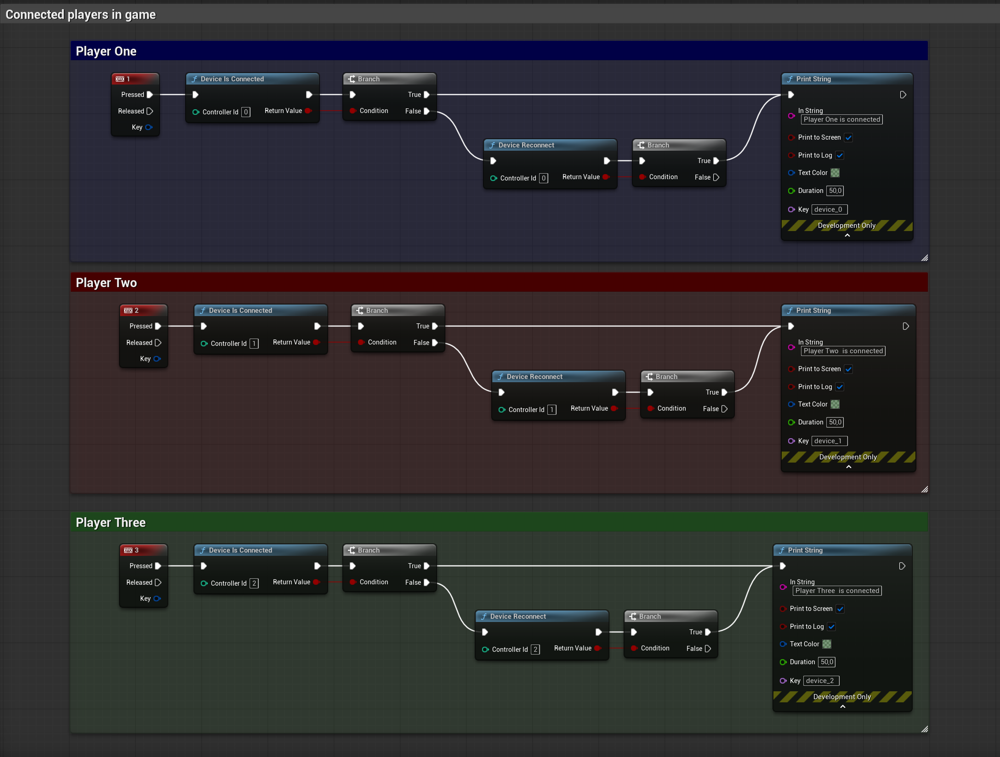

# Windows Dualsense for Unreal Engine version 5.2 ~ 5.6


### **Plugin with full support for the DualSense PS5 controller in Unreal Engine versions  5.2 ~ 5.6, for Windows platforms. No configuration needed**

### The controller's customization commands, such as vibration, haptic feedback, and LEDs, can be implemented directly via C++ or Blueprints. Below, we provide examples of both implementations.

### Supports settings of triggers, haptic feedback triggers, unreal native force feedback blueprint, vibrations, leds, battery level, gyroscope, accelerometer etc..

### [Links for installation](#Install-on-FAB-official-page-plugin-)

# Usage via Blueprints
### [See the example video](https://www.youtube.com/watch?v=GrCa5s6acmo)

### Controller Vibration, Audio, and Motor Force Reduction Settings

### Vibration Modes
You can easily customize the vibration mode of the DualSense controller to suit your gameplay needs. This includes switching between different rumble patterns and intensities or applying advanced trigger haptics for more immersive feedback. Both C++ and Blueprint interfaces are available for fine-grained control.

### Audio Configuration
The plugin supports audio-based vibration, allowing controller rumble to be driven by real-time audio signals from the game. This feature creates a more dynamic and immersive haptic experience, as the controller responds to in-game audio effects.

Use vibration mode `EDualSenseDeviceFeatureReport::HapticSoftRumble` when connected via USB for vibration and automatic synchronization of rumble with in-game audio, with no additional setup required.

If you are using Bluetooth, use `EDualSenseDeviceFeatureReport::DefaultRumble`. In this case, you will need to configure audio-based vibration manually as shown in the [Audio-Based Vibration Support](#audio-based-vibration-support) section.


### Soft Rumble (Motor Force Reduction)
To provide a softer, less intense vibration, you can reduce the force of the vibration motors. This setting is useful for creating subtle feedback or making long play sessions more comfortable.

**Example settings in Blueprints:**
Open the settings menu in your Blueprint graph to adjust vibration mode, toggle audio-based rumble, and configure the Soft Rumble Reduce option, as shown in the image below:



### Basic example to check connection, reconnect or disconnect device.


### Basic example apply LEDs to the DualSense.



### Haptic trigger feedback



### Battery level, it's recommended to use a timer to avoid drops in FPS.


### Audio-Based Vibration Support
The plugin now features audio-based vibration support, enabling controller vibrations to react dynamically to in-game audio signals. This provides a more immersive and responsive user experience.



# Example of using DualSense effects via C++

### Trigger effects
```
MyClass::MyClass()
{
	/**
	 * Triggers a haptic feedback effect for an automatic gun using the DualSense controller.
	 *
	 * @param ControllerId The ID of the controller to apply the effect on.
	 * @param BeginStrength The starting vibration strength of the trigger effect. If invalid, a default value of 8 is used.
	 * @param MiddleStrength The middle vibration strength of the trigger effect. If invalid, a default value of 8 is used.
	 * @param EndStrength The ending vibration strength of the trigger effect. If invalid, a default value of 8 is used.
	 * @param Hand The controller hand (left or right) to which the effect is applied.
	 * @param KeepEffect Whether to keep the effect active continuously.
	 */
	UDualSenseProxy::AutomaticGun(0, 0, 0, 8, EControllerHand::Left, true);

	/**
	 * Configures a weapon effect on the DualSense controller using specified parameters.
	 *
	 * @param ControllerId The identifier for the target DualSense controller.
	 * @param StartPosition The starting position of the effect in the trigger. The value should be validated and within the range of allowed positions.
	 * @param EndPosition The ending position of the effect in the trigger. The value should be validated and within the range of allowed positions.
	 * @param Strength The strength of the weapon effect. The value should be validated and within the range of allowed strengths.
	 * @param Hand Specifies which controller hand (left or right) should be affected by the weapon effect.
	 */
	UDualSenseProxy::Weapon(0, 0, 0, 8, EControllerHand::AnyHand);

	/**
	 * @brief Triggers a galloping vibration effect on a DualSense controller.
	 *
	 * This function sets up and activates a galloping vibration pattern by defining
	 * the movement positions, associated vibration intensity, frequency, and the hand
	 * where the effect plays.
	 *
	 * @param ControllerId The ID of the controller to apply the effect.
	 * @param StartPosition The initial position of the galloping effect.
	 * @param EndPosition The final position of the galloping effect.
	 * @param FirstFoot The intensity for the first "foot" step in the galloping effect. 
	 * @param SecondFoot The intensity for the second "foot" step in the galloping effect.
	 * @param Frequency The frequency at which the galloping effect repeats.
	 * @param Hand Specifies whether the effect is applied to the left or right hand.
	 */
	UDualSenseProxy::Galloping(0, 2, 5, 2, 5, 0.005, EControllerHand::Left);

	/**
	 * Applies a resistance effect to the trigger of a PlayStation DualSense controller.
	 *
	 * This method configures the specified trigger to provide resistance feedback based on
	 * the given start position, end position, and strength parameters. The effect is applied
	 * to the controller defined by the ControllerId and the trigger specified using the Hand parameter.
	 *
	 * @param ControllerId The identifier of the controller to apply the resistance effect.
	 * @param StartPosition The starting position of the resistance zone within the trigger's range. Value must be between 0 and 8.
	 * @param EndPosition The ending position of the resistance zone within the trigger's range. Value must be between 0 and 8.
	 * @param Strength The strength of the resistance effect. Value must be between 0 and 8, with higher values indicating stronger resistance.
	 * @param Hand The trigger to apply the effect to, specified as EControllerHand (e.g., Left or Right).
	 */
	UDualSenseProxy::Resistance(0, 1, 8, 8, EControllerHand::Right);
	
}
```
### Example reset effects
```
MyClass::MyClass()
{
	/**
	 * Stops all trigger effects currently active for the specified DualSense controller.
	 *
	 * @param ControllerId The ID of the DualSense controller for which to stop all trigger effects.
	 */
	UDualSenseProxy::StopAllTriggersEffects(0);

	/**
	 * Stops the trigger effect on a specific controller for the specified hand.
	 *
	 * @param ControllerId The unique identifier of the controller for which the trigger effect should be stopped.
	 * @param HandStop Specifies which hand's trigger effect (left or right) should be stopped.
	 */
	UDualSenseProxy::StopTriggerEffect(0, EControllerHand::Left);
	UDualSenseProxy::StopTriggerEffect(0, EControllerHand::Right);
	UDualSenseProxy::StopTriggerEffect(0, EControllerHand::AnyHand);
}
```
>NOTE: Support for **DualShock 4** controllers is still under development.  
Some features may be incomplete or unavailable in the current version.

### Configs Commons (DualSense) and (DualShock 4)
```
    /**
	 * Checks if the DualSense or DualShock device with the specified Controller ID is connected.
	 *
	 * @param ControllerId The ID of the controller to check for connectivity.
	 * @return True if the DualSense or DualShock  device is connected, false otherwise.
	 */
	USonyGamepadProxy::DeviceIsConnected(int32 ControllerId);

	/**
	 * Attempts to reconnect a DualSense or DualShock controller based on the given controller ID.
	 * If the controller is successfully reconnected, the operation returns true;
	 * otherwise, it returns false.
	 *
	 * @param ControllerId The ID of the controller to reconnect.
	 * @return Returns true if the controller was successfully reconnected, false otherwise.
	 */
	USonyGamepadProxy::DeviceReconnect(int32 ControllerId);

	/**
	 * Disconnects the DualSense or DualShock device associated with the given Controller ID.
	 * This method removes the library instance associated with the specified controller.
	 *
	 * @param ControllerId The ID of the DualSense or DualShock or DualShock controller to be disconnected.
	 * @return true if the disconnection was initiated successfully.
	 */
	USonyGamepadProxy::DeviceDisconnect(int32 ControllerId);

	/**
	 * Retrieves the battery level of the DualSense or DualShock controller for the specified controller ID.
	 *
	 * This method uses the DualSense or DualShock library instance associated with the provided controller ID
	 * to fetch the battery level. If the library instance is not found, the method returns 0.0f.
	 *
	 * @param ControllerId The ID of the DualSense or DualShock controller to query.
	 * @return The battery level of the controller as a float. Returns 0.0f if the library instance cannot be retrieved.
	 */
	USonyGamepadProxy::LevelBatteryDevice(int32 ControllerId);

	/**
	 * Updates the LED color effects on a DualSense controller using the specified color.
	 *
	 * @param ControllerId The identifier of the controller whose LED color will be updated.
	 * @param Color The color to set on the controller's LED.
	 */
	USonyGamepadProxy::LedColorEffects(int32 ControllerId, FColor Color);

	/**
	 * Controls the LED player light effects on the DualSense controller.
	 *
	 * @param ControllerId The identifier for the target controller.
	 * @param Value The LED pattern enum specifying the LED configuration for the player indicator (e.g., Off, Player One, Player Two, etc.).
	 * @param Brightness The brightness level of the LED lights specified by an enum (e.g., Low, Medium, High).
	 */
	USonyGamepadProxy::LedPlayerEffects(int32 ControllerId, ELedPlayerEnum Value, ELedBrightnessEnum Brightness);

	/**
	 * Controls the LED and microphone visual effects on a DualSense controller.
	 *
	 * @param ControllerId The ID of the DualSense controller to be affected.
	 * @param Value The desired LED and microphone effect to apply, represented as an ELedMicEnum value.
	 */
	USonyGamepadProxy::LedMicEffects(int32 ControllerId, ELedMicEnum Value);

```
### Vibrations
``` 
    // Vibrations example
    PlayDynamicForceFeedback(0.5f, 3.f, true, true, true, true);
```
## Multiple players with multiple controllers

### In your GameMode, add the players.



### After that, connect the players to the controllers.



MyGameModeBase.h
```
   #pragma once
   
   #include "CoreMinimal.h"
   #include "GameFramework/GameModeBase.h"
   #include "MyGameModeBase.generated.h"
   
   /**
    * 
    */
   UCLASS()
   class PLUGINTESTE_API AMyGameModeBase : public AGameModeBase
   {
       GENERATED_BODY()
   public:
       AMyGameModeBase();
       virtual void BeginPlay() override;
   
   protected:
       UPROPERTY(EditAnywhere, BlueprintReadWrite, Category = "GameMode")
       TSubclassOf<APawn> Player1PawnClass;
   
       virtual void PostLogin(APlayerController* NewPlayer) override;
       virtual void HandleConnectedControllers(APlayerController* PlayerController);
   };
```
MyGameModeBase.cpp
```
   // MyGameModeBase.cpp
   
   
   #include "MyGameModeBase.h"
   
   AMyGameModeBase::AMyGameModeBase()
   {
       static ConstructorHelpers::FClassFinder<APawn> Player(TEXT("/Game/ThirdPerson/Blueprints/BP_ThirdPersonCharacter.BP_ThirdPersonCharacter_C"));
       if (Player.Class != nullptr)
       {
           DefaultPawnClass = Player.Class;
       }
       PlayerControllerClass = APlayerController::StaticClass();
   }
   
   void AMyGameModeBase::BeginPlay()
   {
       Super::BeginPlay();
   }
   
   void AMyGameModeBase::PostLogin(APlayerController* NewPlayer)
   {
       Super::PostLogin(NewPlayer);
       
       UE_LOG(LogTemp, Warning, TEXT("Player local %d login..."), NewPlayer->GetLocalPlayer()->GetControllerId())
   
       const int32 PlayerId = NewPlayer->GetLocalPlayer()->GetControllerId();
       if (constexpr int32 MaxPlayer = 2; NewPlayer->IsLocalController() &&  (PlayerId + 1) < MaxPlayer)
       {
           HandleConnectedControllers(NewPlayer);
       }
   
       if (NewPlayer->IsLocalController() && NewPlayer->GetLocalPlayer()->GetControllerId() > 0)
       {
           FTimerHandle TimerHandle;
           GetWorld()->GetTimerManager().SetTimer(
               TimerHandle,
               FTimerDelegate::CreateLambda([=]()
               {
                   FCoreDelegates::OnUserLoginChangedEvent.Broadcast(true, NewPlayer->GetLocalPlayer()->GetControllerId(), NewPlayer->GetLocalPlayer()->GetControllerId());
               }),
               0.2f,
               false
           );
       }
   }
   
   void AMyGameModeBase::HandleConnectedControllers(APlayerController* PlayerController)
   {
       UE_LOG(LogTemp, Warning, TEXT("Registering new player..."));
       
       if (!GetWorld() || !GetGameInstance() || !PlayerController)
       {
           UE_LOG(LogTemp, Error, TEXT("GameInstance or World are not available."));
           return;
       }
   
       FString Error;
       UGameInstance* GameInstance = GetGameInstance();
       if (const ULocalPlayer* NewLocalPlayer = GameInstance->CreateLocalPlayer(PlayerController->GetLocalPlayer()->GetControllerId() + 1, Error, true))
       {
           UE_LOG(LogTemp, Warning, TEXT("New player created for ControllerId: %d"), NewLocalPlayer->GetControllerId());
       }
   }
```

# Install on FAB official page plugin 

To install this plugin directly via FAB (Official Source), follow the steps below:

1. **Access the plugin's official page on FAB**  
   Go to the official plugin page [by clicking here](https://www.fab.com/listings/e77a8f1d-8bbe-4673-a5ae-7f222c8c0960).

3. **Install the Plugin**
   - On the plugin page, click the **Install** or **Add to Project** button (depending on the FAB interface).
   - Choose your Unreal Engine project where the plugin will be used, or simply download it for manual setup.

4. **Configure in Unreal Engine**
   - Open your project in Unreal Engine.
   - Go to the **Plugins** tab under `Edit > Plugins`.
   - Search for `Windows DualSense Plugin` in the list and enable it if necessary.
   - Restart the project to apply the changes.

---
## 📍 Roadmap

To follow ongoing development and planned features for DualShock and DualSense support, please check our project roadmap:

[🔗 View the Roadmap on GitHub Projects](https://github.com/users/rafaelvaloto/projects/2)

---

## Contributions
Thanks to,

[DualSense on Windows API](https://github.com/Ohjurot/DualSense-Windows) library, which facilitated the development of this plugin.

[Nielk1 on GIST](https://gist.github.com/Nielk1/6d54cc2c00d2201ccb8c2720ad7538db) code, which facilitated the development of this plugin.

[DualSenseAPI](https://github.com/BadMagic100/DualSenseAPI/tree/master) library, which facilitated the development of this plugin.

[flok pydualsense](https://github.com/flok/pydualsense) library, which facilitated the development of this plugin.