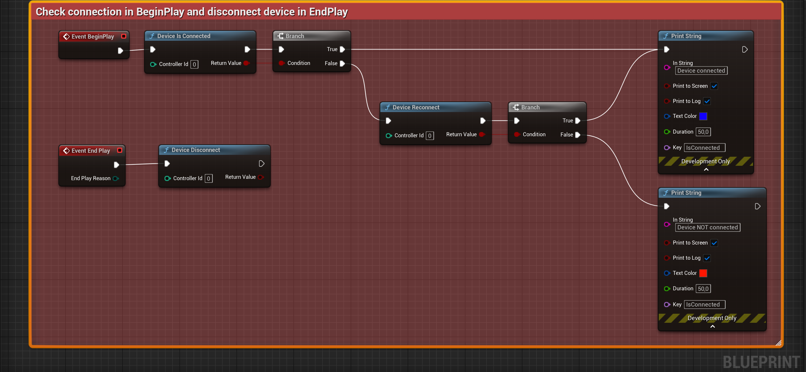
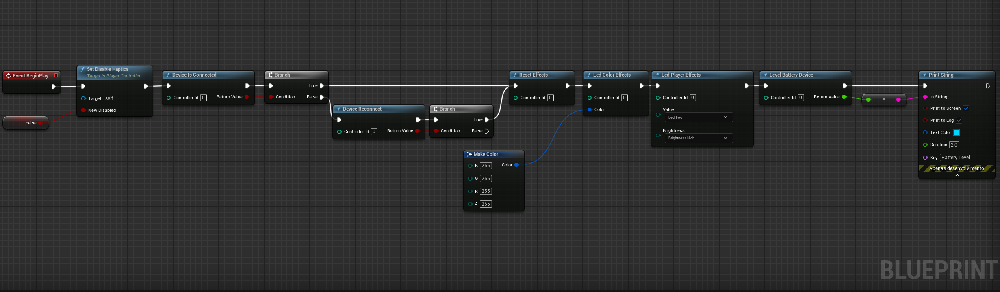
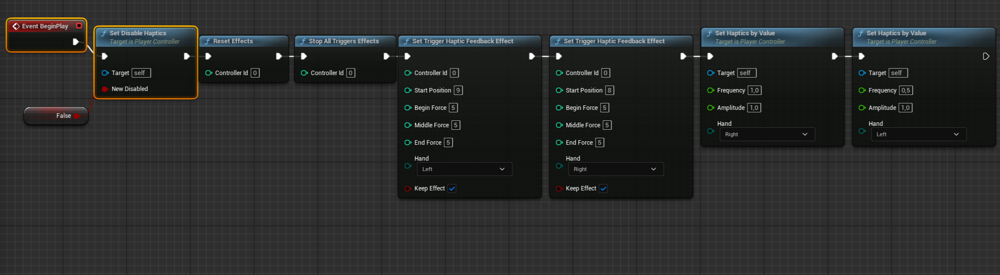

# Windows Dualsense for Unreal Engine version 5.2 ~ 5.6

### **Plugin with full support for the DualSense PS5 controller in Unreal Engine versions  5.2 ~ 5.6, for Windows platforms. No configuration needed**

### The controller's customization commands, such as vibration, haptic feedback, and LEDs, can be implemented directly via C++ or Blueprints. Below, we provide examples of both implementations.

### Supports settings of triggers, haptic feedback triggers, unreal native force feedback blueprint, vibrations, leds, battery level, gyroscope, accelerometer etc..

### [Links for installation](#Install-on-FAB-official-page-plugin)

# Usage via Blueprints
### [See the example video](https://1drv.ms/v/c/6c07d40187e87b76/EYPKCwWTTuZGqLC7pVkyGgEBONfwM-6fQKzt-RzBpQsKKg?e=lUp8kh)

### Basic example to check connection, reconnect or disconnect device.



### Basic example apply LEDs to the DualSense.



### Haptic trigger feedback



# Example of using DualSense effects via C++

### Trigger effects
```
    // Forces max value 8
    // Positions max value 8
    
    int32 ControllerId = 0; 

    UDualSenseProxy::EffectWeapon(int32 ControllerId, int32 StartPosition, int32 EndPosition, int32 Force, EControllerHand Hand);
      
    UDualSenseProxy::EffectGalloping(ControllerId, 5, 8, 5, 7, 0.01f, EControllerHand::Left);
    UDualSenseProxy::EffectGalloping(ControllerId, 0, 5, 0, 4, 0.005f, EControllerHand::Right);
      
    UDualSenseProxy::EffectMachine(ControllerId, 1, 5, 1, 5, 0.5f, 3.f, EControllerHand::Left);
    UDualSenseProxy::EffectMachine(ControllerId, 5, 8, 5, 8, 0.4f, 1.0f, EControllerHand::Right);
      
    UDualSenseProxy::EffectBow(ControllerId, 0, 5, 5, 8, EControllerHand::Left);
    UDualSenseProxy::EffectBow(ControllerId, 5, 8, 8, 8, EControllerHand::Right);
      
    UDualSenseProxy::EffectContinuousResitance(int32 ControllerId, int32 StartPosition, int32 EndPosition, EControllerHand Hand);
    UDualSenseProxy::EffectContinuousResitance(ControllerId, 1, 4, EControllerHand::Right);

    // Start position max value 8 | Forces max value 8
    UDualSenseProxy::EffectSectionResitance(ControllerId, 1, 8, EControllerHand::Left); 
    UDualSenseProxy::EffectContinuousResitance(ControllerId, 5, 8, EControllerHand::Right);
```
### Example reset effects
```
    int32 ControllerId = 0;
   
    // Stop triggers effects
    UDualSenseProxy::StopAllTriggersEffects(ControllerId);
    UDualSenseProxy::StopTriggerEffect(ControllerId, EControllerHand::Left);
    UDualSenseProxy::StopTriggerEffect(ControllerId, EControllerHand::Right);

    // Normalize triggers
    UDualSenseProxy::EffectNoResitance(ControllerId, EControllerHand::Left);
    UDualSenseProxy::EffectNoResitance(ControllerId, EControllerHand::Right);
    
    // Normalize triggers
    UDualSenseProxy::EffectNoResitance(ControllerId, EControllerHand::Left);
    UDualSenseProxy::EffectNoResitance(ControllerId, EControllerHand::Right);
```
### Example haptics effects
```
   int32 ControllerId = 0; 
   
    // Start position max value 8 | Forces max value 8
    UDualSenseProxy::SetTriggerHapticFeedbackEffect(ControllerId, 8, 0, 0, 6, EControllerHand::Left, true);
    UDualSenseProxy::SetTriggerHapticFeedbackEffect(ControllerId, 8, 0, 0, 7, EControllerHand::Right, true);

    // SetHapticsByValue is a method of PlayerController.
    SetHapticsByValue(0.1f, 1.0f, EControllerHand::Left);
    SetHapticsByValue(1.0f, 1.0f, EControllerHand::Right);
```

### Players and led effects
```
   #include "DualSenseProxy.h"
   
   void APlayerController::BeginPlay()
   {
       Super::BeginPlay();
       
       int32 ControllerId = 0; 
       
       // Reset buffer all values 
       UDualSenseProxy::ResetEffects(ControllerId);
       
       // Gyroscope and Accelerometer are set to false by default.
       UDualSenseProxy::EnableAccelerometerValues(ControllerId, false);
       UDualSenseProxy::EnableGyroscopeValues(ControllerId, false);
   
       // Touch pad values default false
       UDualSenseProxy::EnableTouch1(ControllerId, false);
       UDualSenseProxy::EnableTouch2(ControllerId, false);
   
       // Level battery Full load max 100.0f
       float levelBattery = UDualSenseProxy::LevelBatteryDevice(ControllerId);
   
       // Leds configs
       UDualSenseProxy::LedMicEffects(ControllerId, ELedMicEnum::MicOn);
       UDualSenseProxy::LedPlayerEffects(ControllerId, ELedPlayerEnum::One, ELedBrightnessEnum::Medium);
       UDualSenseProxy::LedColorEffects(ControllerId, FColor(255, 255, 255));
   }

```
### Vibrations

##### The plugin is compatible with Unreal's native Blueprints Force Feedback
``` 
    // Vibrations example 
    PlayDynamicForceFeedback(0.5f, 3.f, true, true, true, true);
```
## Multiple players with multiple controllers

MyGameModeBase.h
```
   #pragma once
   
   #include "CoreMinimal.h"
   #include "GameFramework/GameModeBase.h"
   #include "MyGameModeBase.generated.h"
   
   /**
    * 
    */
   UCLASS()
   class PLUGINTESTE_API AMyGameModeBase : public AGameModeBase
   {
       GENERATED_BODY()
   public:
       AMyGameModeBase();
       virtual void BeginPlay() override;
   
   protected:
       UPROPERTY(EditAnywhere, BlueprintReadWrite, Category = "GameMode")
       TSubclassOf<APawn> Player1PawnClass;
   
       virtual void PostLogin(APlayerController* NewPlayer) override;
       virtual void HandleConnectedControllers(APlayerController* PlayerController);
   };
```
MyGameModeBase.cpp
```
   // MyGameModeBase.cpp
   
   
   #include "MyGameModeBase.h"
   
   AMyGameModeBase::AMyGameModeBase()
   {
       static ConstructorHelpers::FClassFinder<APawn> Player(TEXT("/Game/ThirdPerson/Blueprints/BP_ThirdPersonCharacter.BP_ThirdPersonCharacter_C"));
       if (Player.Class != nullptr)
       {
           DefaultPawnClass = Player.Class;
       }
       PlayerControllerClass = APlayerController::StaticClass();
   }
   
   void AMyGameModeBase::BeginPlay()
   {
       Super::BeginPlay();
   }
   
   void AMyGameModeBase::PostLogin(APlayerController* NewPlayer)
   {
       Super::PostLogin(NewPlayer);
       
       UE_LOG(LogTemp, Warning, TEXT("Player local %d login..."), NewPlayer->GetLocalPlayer()->GetControllerId())
   
       const int32 PlayerId = NewPlayer->GetLocalPlayer()->GetControllerId();
       if (constexpr int32 MaxPlayer = 2; NewPlayer->IsLocalController() &&  (PlayerId + 1) < MaxPlayer)
       {
           HandleConnectedControllers(NewPlayer);
       }
   
       if (NewPlayer->IsLocalController() && NewPlayer->GetLocalPlayer()->GetControllerId() > 0)
       {
           FTimerHandle TimerHandle;
           GetWorld()->GetTimerManager().SetTimer(
               TimerHandle,
               FTimerDelegate::CreateLambda([=]()
               {
                   FCoreDelegates::OnUserLoginChangedEvent.Broadcast(true, NewPlayer->GetLocalPlayer()->GetControllerId(), NewPlayer->GetLocalPlayer()->GetControllerId());
               }),
               0.2f,
               false
           );
       }
   }
   
   void AMyGameModeBase::HandleConnectedControllers(APlayerController* PlayerController)
   {
       UE_LOG(LogTemp, Warning, TEXT("Registering new player..."));
       
       if (!GetWorld() || !GetGameInstance() || !PlayerController)
       {
           UE_LOG(LogTemp, Error, TEXT("GameInstance or World are not available."));
           return;
       }
   
       FString Error;
       UGameInstance* GameInstance = GetGameInstance();
       if (const ULocalPlayer* NewLocalPlayer = GameInstance->CreateLocalPlayer(PlayerController->GetLocalPlayer()->GetControllerId() + 1, Error, true))
       {
           UE_LOG(LogTemp, Warning, TEXT("New player created for ControllerId: %d"), NewLocalPlayer->GetControllerId());
       }
   }
```

# Install on FAB official page plugin

To install this plugin directly via FAB (Official Source), follow the steps below:

1. **Access the plugin's official page on FAB**  
   Go to the official plugin page [by clicking here](https://www.fab.com/listings/e77a8f1d-8bbe-4673-a5ae-7f222c8c0960).

3. **Install the Plugin**
   - On the plugin page, click the **Install** or **Add to Project** button (depending on the FAB interface).
   - Choose your Unreal Engine project where the plugin will be used, or simply download it for manual setup.

4. **Configure in Unreal Engine**
   - Open your project in Unreal Engine.
   - Go to the **Plugins** tab under `Edit > Plugins`.
   - Search for `Windows DualSense Plugin` in the list and enable it if necessary.
   - Restart the project to apply the changes.


# Manual Installation

Download plugin UE_Version

v1.1.7 latest
### Added
- DualSense Edge controller support
- Custom button mapping functionality
- Additional back button inputs (FL/FR)

[UE 5.2 download plugin WindowsDualsense1.7.zip](https://drive.google.com/file/d/11y84IfAD39L7b1sQt9baPc1p0gVQuaQu/view?usp=drive_link)

[UE 5.3 download plugin WindowsDualsense1.7.zip](https://drive.google.com/file/d/12uUGX8TibfPIssEPNERfm6AekUfxZ9Bh/view?usp=drive_link)

[UE 5.4 download plugin WindowsDualsense1.7.zip](https://drive.google.com/file/d/1FrLaRdsUAE--6jXYKp8aw_onxbtrqlVN/view?usp=drive_link)

[UE 5.5 download plugin WindowsDualsense1.7.zip](https://drive.google.com/file/d/1xhpELcftJTB1y44Yqfv2ixD2BK-0hhUe/view?usp=drive_link)

[UE 5.6 download plugin WindowsDualsense1.7.zip](https://drive.google.com/file/d/1T0u4QFwQe_QpVd1_y4eV0Voq7oW4HVFw/view?usp=drive_link)

v1.1.6
- Fixed issues with controller disconnection and reconnection handling
- Improved controller auto-reconnection stability
- Enhanced detection and recovery of controller connection states

[UE 5.2 download plugin WindowsDualsense1.6.zip](https://drive.google.com/file/d/1xmOU56rCx9uLGbcb-WOwQ4Opz-UWMr4e/view?usp=drive_link)

[UE 5.3 download plugin WindowsDualsense1.6.zip](https://drive.google.com/file/d/1oQ2LODFi7blEJ5pQvR0fOWOkIEI6NxoP/view?usp=drive_link)

[UE 5.4 download plugin WindowsDualsense1.6.zip](https://drive.google.com/file/d/13UZb9Rx2uFo4OBr3QbVrxUH7GZg_U0yw/view?usp=drive_link)

[UE 5.5 download plugin WindowsDualsense1.6.zip](https://drive.google.com/file/d/1Isc7Sg15qqJ0YhgqiBNkuuGTsnuSu8iG/view?usp=drive_link)

[UE 5.6 download plugin WindowsDualsense1.6.zip](https://drive.google.com/file/d/1i-5sE1fwv6TcKMMS96S02p2nytA3xm0o/view?usp=drive_link)

## Installing the Plugin in the Project's Directory


For your convenience, here are the resources:

Video Tutorial: [Watch here](https://drive.google.com/file/d/1i4afhW-tG-FkWqjeI6sDr8aoo5KcnPZI/view?usp=sharing)

### Steps:

Here’s a brief outline of the installation and compilation steps shown in the video:

1. Create a new Unreal Engine project.
   - Navigate to the directory where your Unreal project is located. The default location is typically:
   -      C:\Users\<User>\Documents\Unreal Projects\<ProjectName>\Plugins

   
2. Copy the extracted plugin folder to your project's `Plugins` directory:
   -      C:\Users\<User>\Documents\Unreal Projects\<ProjectName>\Plugins

**Note**: If the `Plugins` folder does not exist, create it manually in your project's root folder.

3. Activate the Plugin:
   - Go to the **Plugins** section in Unreal Engine:
   -      Edit > Plugins > WindowsDualsense_ds5w

- Enable the plugin if it is not already active. 
4. **Restart the Unreal Editor**:
   - After enabling the plugin, close and restart the Unreal Editor to apply the changes.

## Make the Plugin Available for All Projects

If you want to make the plugin available for all Unreal Engine projects, follow these steps:

1. **Compile the Plugin**:
   - Open the Unreal Editor with a project where the plugin is integrated.
   - Navigate to the **Plugins** section:
   -      Edit > Plugins > WindowsDualsense_ds5w
- Click on the **Package** button for the plugin. This will generate the compiled files needed.

2. **Move the Compiled Plugin**:
   - Once the plugin is successfully compiled, navigate to the output directory where the packaged files were generated (typically inside your project directory).
   - Copy the compiled plugin files and move them to the following directory:
   -      C:\Program Files\Epic Games\UE_{Version}\Engine\Plugins


3. **Access the Plugin From Any Project**:
   - Now the plugin is installed globally for all Unreal Engine Version projects. You can enable it in any project directly from the Unreal Editor's **Plugins** menu. 


## Contributions
Thanks to,


[Nondebug Dualsense](https://github.com/nondebug/dualsense/blob/main/report-descriptor-bluetooth.txt) instructions, which facilitated the development of this plugin.

[DualSense on Windows API](https://github.com/Ohjurot/DualSense-Windows) library, which facilitated the development of this plugin.

[Nielk1 on GIST](https://gist.github.com/Nielk1/6d54cc2c00d2201ccb8c2720ad7538db) code, which facilitated the development of this plugin.

[DualSenseAPI](https://github.com/BadMagic100/DualSenseAPI/tree/master) library, which facilitated the development of this plugin.

[flok pydualsense](https://github.com/flok/pydualsense) library, which facilitated the development of this plugin.

***

> **UPDATED NOTE (2025-06-04)**
> 
>This update replaces the previous implementation, which relied on a third-party DLL located in the `ThirdParty` directory, with a direct integration using the native Windows HIDAPI.
>
>If you have cloned the project and still use the older version with the third-party DLL, please update to this latest version to benefit from the native HIDAPI integration.
>
> This eliminates the dependency on external DLLs and provides a more streamlined setup.
> For convenience, you can also download the latest version as a ZIP file from the repository or documentation links provided.